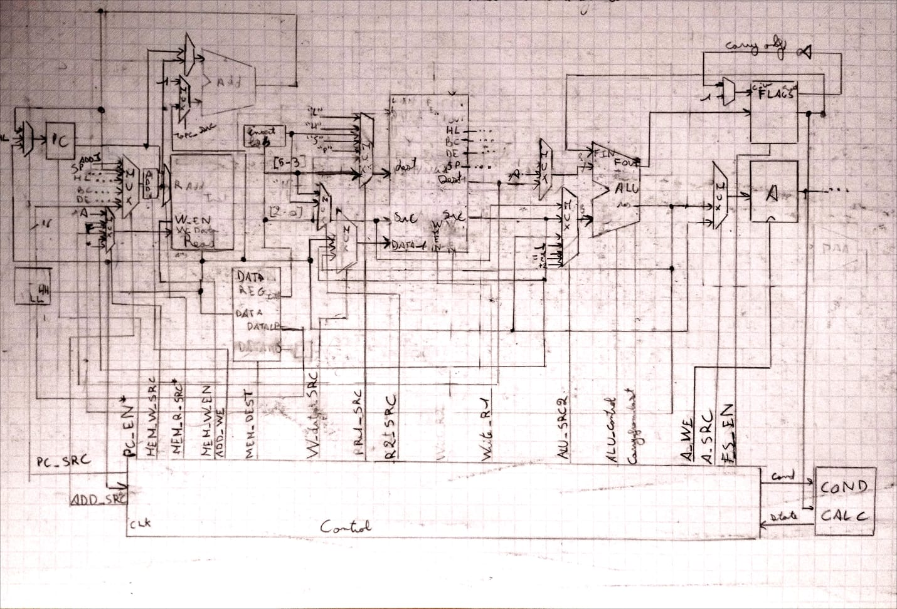

# FPGB

This is mostly an application project of a digital design course oriented. 
But the goal is nevertheless to create a working and clock cycle accurate implementation in VHDL of the Game Boy hardware and synthetize it for a FPGA.

The target FPGA model is a Zynq-7020. 

Work is in progress

# Progress :

## CPU :

The designed microarchitecture of the processor is the following : 

*This is a temporary image, a cleaner one will be made when the design will be completly implemented*

The design has been made to be clock cycle accurate.

All the data bus are 8 bit (or less), the 8 bit operation are all simulated. The main reason is that the real timing of the gameboy (according to gekkio's documentation [1]) seem to suggest that 16 bit operation are simulated.

### Register file :
*Source : vhd/registers.vhdl* 

It's constitued of 8\*8bit register corresponding to the register (in order) : b, c, d, e, h, s, p

The interface is the following : 

- 4 direct output of 16 bit registers : bc, de, hl, sp

- 2 read input with their corresponding output

- Write enable control signal for the dest register

The F and A register holding particular roles are kept outside the register file.

The read is combinationnal. The write sequential.

### ALU : 
*Source : vhd/alu.vhdl*

The alu perform all the arithmetical, logical, shifting and testing operation of the ISA. 

It's interface is : 

- 2 data input, one data ouput (8 bit bus)

- input from the flag register, output to the flag register (the write enable for each bit of the flag is managed by the control part) (8 bit bus)

- control signal (ALU_control type)

The data and flag output is combinationnal, but to simulate the 16 bit operation (only addition) an inner carry bit register is needed.

### Control :

Source : *vhd/control.vhdl* , *vhd/control_signal.vhdl* for the control signal type definition

The description of the control part is still to be made.

### Rest of the parts:

*Still to be made*

## Other hardware :

*Design for the rest of the hardware is still to be done*

# References :

The following reference has been used, and I thanks their respective maintainer : 

1. GBDev's gameboy hardware documentation : [pandocs](https://gbdev.io/pandocs)

2. GBDev's optable : [https://gbdev.io/gb-opcodes/optables/](https://gbdev.io/gb-opcodes/optables/)

3. gekkio's [Game Boy: Complete Technical Reference](https://gekkio.fi/files/gb-docs/gbctr.pdf)
